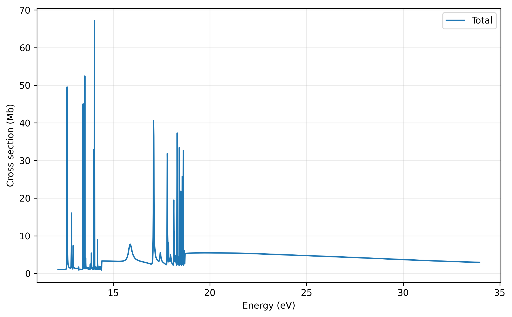

# Multiphoton Spectra simulator

Scientific computing package for modeling light-matter interactions and molecular dynamics in ultrafast photoionization processes.

The project is being currently written into a modular C++/PETSc codebase. The theory for continuum discretization has already been published with comparison against attosecond interferometric experimental results in peer-reviewed journal Physical Review Letters, 135, 223202.

## Project status

The original C implementation is retained in the repository as a reference while the functionality is being rebuilt and tested in C++.

Currently, it can reproduce published one-photon results using transition amplitudes as the starting point.

## Plotting

The output cross sections can be plotted using the Python script
`plotting/plot_cross_sections.py`.

Use `plotting/requirements.txt` to install dependencies. 

1. Plot the total cross section
`python3 plotting/plot_cross_sections.py output/cross_sections.dat --output figures/output.png`

2. Plot selective cation state 
`python3 plotting/plot_cross_sections.py output/cross_sections.dat --states 1 2 --output figures/state_1_2.png`

3. Plot all cation states
`python3 plotting/plot_cross_sections.py output/cross_sections.dat --all --output figures/state_all.png`

## Example cross-sections

The calculated total photoionization cross sections for the first three cation states of water is shown below

